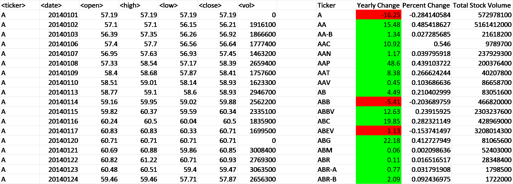
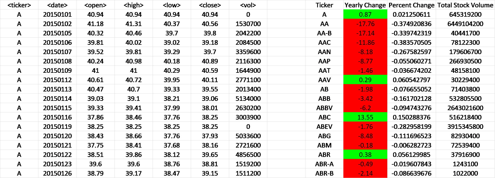
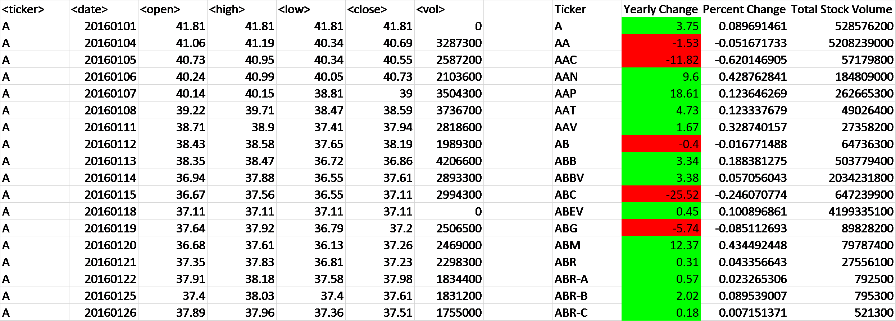
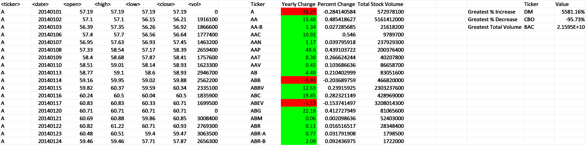
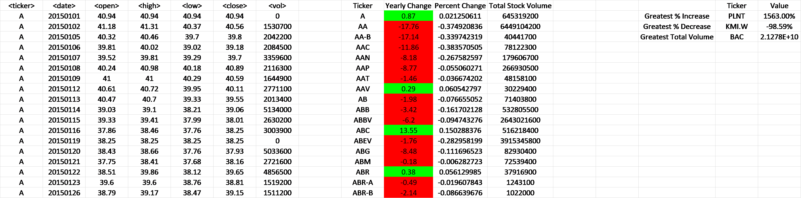
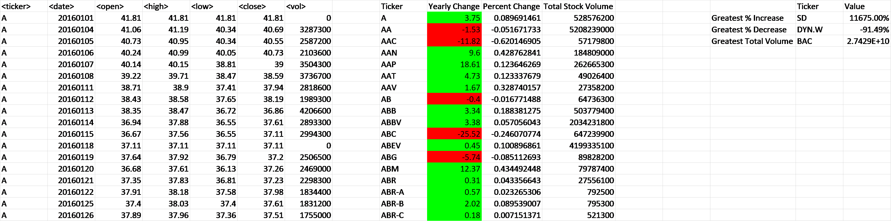

# VBA-stock market analysis

* Create a script that looped through all the stocks for one year for each run baased on 

  * Ticker symbol
  
  * Yearly change from opening price at the beginning of a given year to the closing price at the end of that year.
   

  * The percent change from opening price at the beginning of a given year to the closing price at the end of that year.

  * The total stock volume of the stock.
  
  * Conditional formatting that was used to highlight positive change in green and negative change in red.
  

* We calculated  the stock with the "Greatest % increase", "Greatest % Decrease" and "Greatest total volume". 

